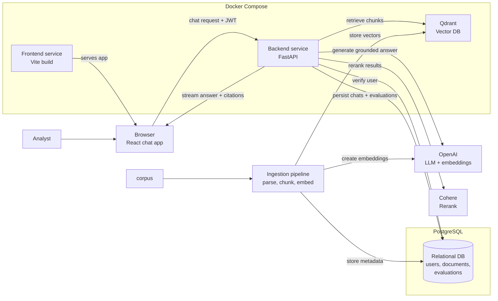

# RAG Knowledge Base Architecture

## Purpose

The RAG Knowledge Base is an internal research assistant that provides grounded answers from a curated document corpus. Every answer is generated from retrieved source passages, every factual claim is citable, and the system fails clearly when the corpus does not support an answer.

This document describes the target architecture for the chat experience, LLM orchestration, retrieval pipeline, evaluation system, and the communication layer between the React SPA and FastAPI backend.

## High-Level Architecture



## Architectural Goals

- Keep the browser thin: it renders chat state and streams assistant responses.
- Keep the backend authoritative: retrieval, grounding, citation checks, LLM orchestration, and database writes happen in FastAPI.
- Use PostgreSQL for relational state: users, trials, documents, chat threads, messages, and evaluation records.
- Use Qdrant for vector storage and dense retrieval, with Qdrant's built-in full-text search for BM25 keyword retrieval.
- Always rerank retrieved chunks through Cohere before passing context to the LLM.
- Use RAGAS to evaluate pipeline quality: faithfulness, answer relevancy, context precision, and context recall.
- Deploy everything via Docker Compose.

## Stack

Frontend:

- Vite + React SPA + TypeScript
- React Router for routing
- Tailwind CSS and shadcn/ui for UI
- Streaming chat via Server-Sent Events

Backend:

- Python 3.12+
- FastAPI + Uvicorn
- Pydantic v2 + pydantic-settings
- OpenAI SDK for LLM generation and embeddings
- Cohere SDK for reranking
- Qdrant Python client (or Pinecone client) for vector storage
- SQLAlchemy + Alembic for relational schema management
- `httpx` for outbound HTTP
- `structlog` for logging
- `uv` for dependency + project management

Persistence:

- PostgreSQL for users, documents, chat threads, messages, and evaluation records
- Qdrant (or Pinecone) for document chunk vectors with metadata for citation tracking

Evaluation:

- RAGAS for computing faithfulness, answer_relevancy, context_precision, and context_recall
- Evaluation runs stored in PostgreSQL for dashboard visualization over time

## System Boundaries

The frontend is responsible for user interaction, local UI state, and sending the authenticated user's request to the backend. It should never hold privileged credentials, run retrieval logic, call OpenAI directly, or write privileged records to the database.

The backend is responsible for request authorization, retrieval, reranking, prompt construction, LLM execution, citation validation, streaming responses, and durable persistence. It owns all privileged credentials.

PostgreSQL and Qdrant are persistence layers accessed exclusively through the backend. They are never exposed to the frontend.

## Request Flow

1. The user signs in through the FastAPI auth endpoint (email/password).
2. FastAPI issues a JWT stored in the frontend.
3. When the user opens a chat, the frontend loads the thread and prior messages through FastAPI, which reads user-scoped records from PostgreSQL.
4. The frontend submits new user messages to the FastAPI chat streaming endpoint.
5. The frontend sends the JWT as `Authorization: Bearer <token>`.
6. FastAPI verifies the JWT before doing any retrieval or LLM work.
7. FastAPI embeds the user's query with OpenAI, retrieves top-K candidates from Qdrant (dense) and BM25 (keyword), fuses results with RRF, reranks with Cohere, then sends the top-N chunks as context to the LLM.
8. FastAPI streams the assistant response and citations back to the frontend via Server-Sent Events.
9. FastAPI persists the user message, assistant message, cited chunks, and usage metadata to PostgreSQL.

## Retrieval Strategy

The RAG Knowledge Base uses a three-stage retrieval pipeline:

1. **Dense Retrieval:** Embed the user's query with the configured OpenAI embedding model. Search Qdrant (or Pinecone) for the nearest vectors.
2. **Keyword Retrieval:** Run BM25 search via Qdrant's built-in full-text index over chunk text for lexical matches.
3. **Fusion:** Fuse the two ranked lists with Reciprocal Rank Fusion (RRF).
4. **Rerank:** Pass the top-K fused results through Cohere Rerank. This is mandatory — reranking drastically improves faithfulness and context precision.
5. **Select:** Take the top-N reranked chunks as LLM context, respecting the model's context window.

Retrieval configuration (collection names, embedding dimensions, top-K, rerank top-N) is defined in `app/config.py`.

## Streaming Contract

The frontend should receive incremental assistant output via Server-Sent Events (SSE), not wait for a full answer. FastAPI exposes a streaming endpoint.

Recommended endpoint:

```text
POST /chat/stream
Authorization: Bearer <jwt>
Content-Type: application/json
```

Request body:

```json
{
  "thread_id": "uuid",
  "message": "user message text"
}
```

Streaming responsibilities:

- Send text deltas as the answer is generated.
- Send citation/source metadata as structured events once available.
- Send clear error events for authentication failures, missing threads, retrieval failures, and grounding failures.
- Persist only after the assistant run completes successfully.

## Citations & Grounding

- The LLM must be prompted to ground its answers strictly in the provided context.
- Every claim must cite the specific chunk ID or document reference used to generate it.
- The frontend maps citation IDs to UI components showing source tooltips/highlights.
- If the context does not contain the answer, the LLM must say "I don't know based on the provided documents."
- The backend validates that all citations map to retrieved chunks before finalizing the response.

## Evaluation Dashboard

RAGAS evaluates pipeline quality. Core metrics:

- `faithfulness`: Are the claims in the answer supported by the context?
- `answer_relevancy`: How relevant is the answer to the question?
- `context_precision`: Does the retrieved context contain only relevant information?
- `context_recall`: Does the retrieved context cover all needed information?

Evaluation runs are stored in PostgreSQL and displayed on the frontend dashboard in tables and simple charts (via Tailwind CSS or recharts for complex visualizations).

## Data Model

PostgreSQL tables:

- `users`: authenticated users (password hash, email, created_at)
- `trials`: clinical trial entity (name, timestamps)
- `trial_members`: user-trial membership (trial_id, user_id, role, joined_at)
- `documents`: uploaded PDFs (trial_id, filename, status, metadata, created_at, deleted_at)
- `document_chunks`: chunk text, metadata, document_id, chunk_index, token_count
- `chat_threads`: thread metadata, trial_id, title, timestamps
- `chat_messages`: user and assistant messages (thread_id, user_id, role, content)
- `message_citations`: normalized citation records linking assistant messages to chunks
- `evaluation_runs`: RAGAS evaluation metadata (trial_id, model, metrics, timestamps)
- `evaluation_results`: per-question metric scores linked to evaluation runs

Qdrant collections:

- `document_chunks`: vectors + payload (chunk_id, document_id, trial_id, page_number, section_title, section_number, source_filename, text)

Each vector payload includes all metadata needed for citation tracking.

## Schema Management

Relational schema changes are managed with SQLAlchemy models and Alembic migrations. The workflow:

1. Update SQLAlchemy models in `app/database/models.py`.
2. Generate a candidate migration: `uv run alembic revision --autogenerate -m "<change>"`
3. Review the generated migration.
4. Apply: `uv run alembic upgrade head`

Vector DB collections and indexes are defined in code (`app/vector_db/setup.py`) and initialized in a startup hook. Do not create collections manually in the Qdrant/Pinecone dashboard.

## Error Handling

Expected error classes:

- `401 Unauthorized`: missing, expired, or invalid JWT.
- `403 Forbidden`: authenticated user tries to access another user's thread.
- `404 Not Found`: thread or source document does not exist.
- `422 Unprocessable Entity`: invalid request payload.
- `502 Bad Gateway`: upstream LLM, Cohere, or vector DB failure.
- `500 Internal Server Error`: unexpected backend failure.

The frontend should render friendly messages while preserving enough technical detail in logs for debugging. Network and CORS failures should be distinguishable from HTTP failures in the shared API client.

## Configuration

Frontend settings (`src/lib/env.ts`):

- `VITE_API_BASE_URL`

Backend settings (`app/config.py`):

- `DATABASE_URL`
- `QDRANT_URL` / `PINECONE_API_KEY`
- `OPENAI_API_KEY`
- `COHERE_API_KEY`
- `SECRET_KEY`
- `ALLOWED_ORIGINS`
- `EMBEDDING_MODEL`
- `EMBEDDING_DIMENSIONS`
- `TOP_K_RETRIEVAL`
- `TOP_N_RERANK`

Fail fast on startup if required config is missing.

## Deployment Shape

Docker Compose runs three or four services:

- Frontend: Vite dev server or static build served via Nginx.
- Backend: FastAPI service running Uvicorn.
- PostgreSQL: relational database.
- Qdrant (optional, if self-hosted): vector database.

The backend can remain stateless — chat threads, documents, chunks, and evaluation records all live in PostgreSQL and Qdrant.

## Implementation Sequence

See [docs/plan.md](./plan.md) for the detailed phased roadmap. The architecture described here covers Phases 1–5.

## Non-Goals

- No Next.js, SSR, or server components.
- No direct OpenAI or Cohere calls from the browser.
- No Supabase Auth. PostgreSQL is self-hosted via Docker for local development.
- No PydanticAI or LangChain/LlamaIndex.
- No multi-tenant architecture.
- No trading recommendations or generated stock picks.
